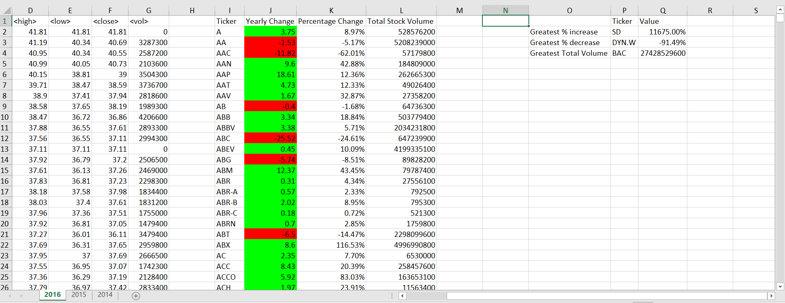

# Stock Price Change Analysis using VBA
The data comprises of prices of over 2800 stocks recorded daily for 3 years. Stock prices change everyday, generating enormous amount of data, the purpose of the project is to analyse change in stock price per year to see the bigger picture of how a stock has performed in a year and compare to its previous two year's performance as well.

## Narrative
The data comprises of 797,771 rows of data. The VBA script loops all the worksheets in the file and :-
* Analyses yearly change of stock price, percentage change, and stock volume traded
* Increase/ decrease are colored using condtional formatting
* Greatest increase, decrease and highest volume stocks for the year are also identified.

## Tools and Technologies used and required to run the Project
* MS Excel
* VBA

## How to run the code
1. Download the Multiple-year Stock Data excel file.
2. Open the file, go to Developer tab, click on Macros option, select the stockprice VBA script in the dialog box, click on Run.
    * Note:-The file will take time to run because there is alot of data and MS Excel takes time to process huge quantity of data. 

## Output

